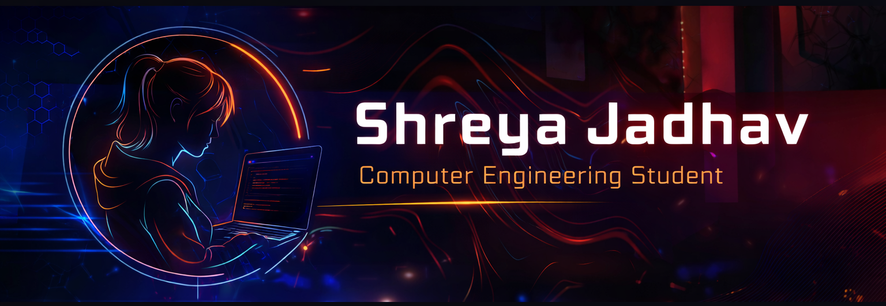

## ✨ About Me

Hi, I'm Shreya. 
I am a Computer Engineering student who enjoys solving problems using Data Structures and Algorithms and building real-world applications. 
I have worked on projects like a Smart Department Management System and a Placement Cell Management System, focusing on practical solutions that improve efficiency. 
Currently, I am exploring backend development, improving my problem-solving skills, and learning how to build scalable systems. 
I like participating in hackathons and technical events because they help me learn faster and work in teams. 
Outside coding, I enjoy organizing events, dancing, and exploring creative ideas.

## 💡 Thought

Striving to become an all-rounder, strong enough to stand alone and solve problems with confidence.

## 🌐 Socials

## 🛠️ Tech Stack

## 📊 Coding Profiles

Actively practicing Data Structures and Algorithms on LeetCode and CodeChef, focusing on improving problem-solving skills and algorithmic thinking.

